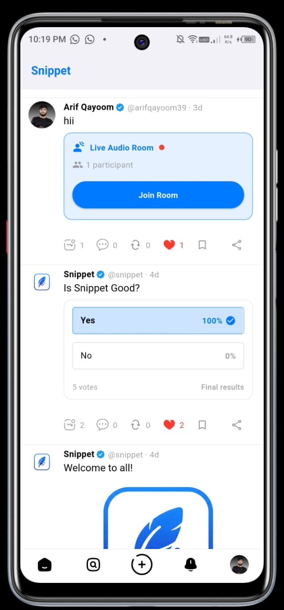
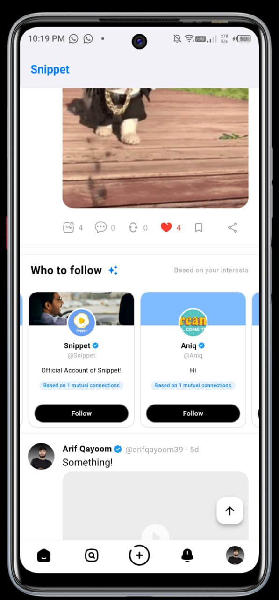
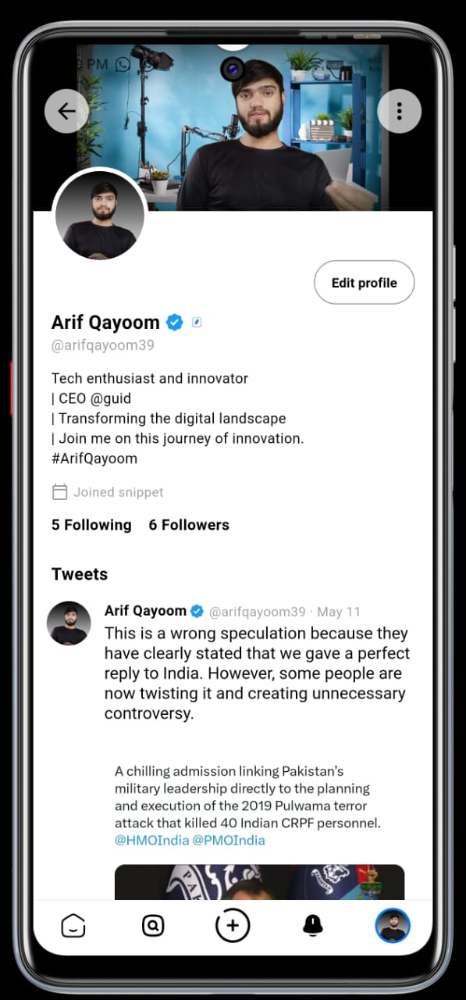
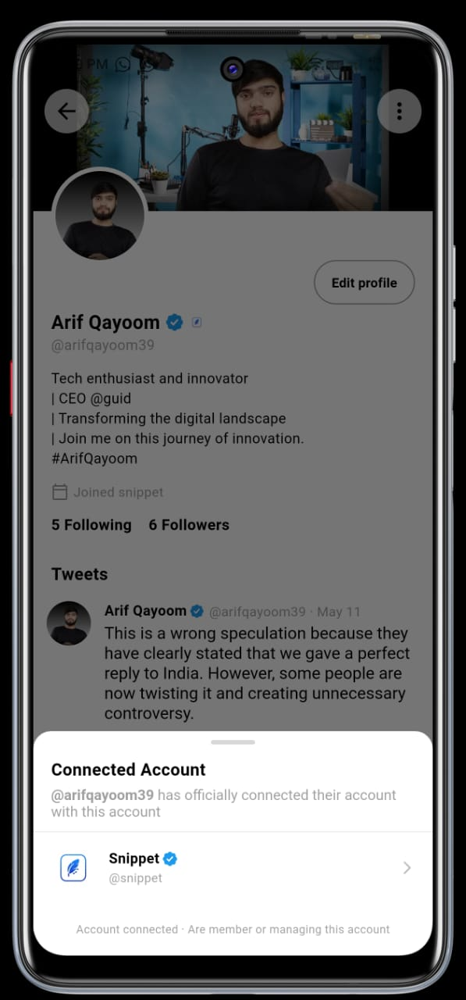
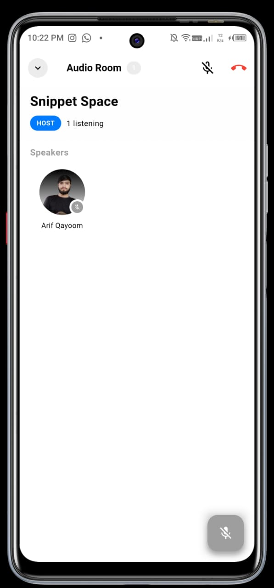
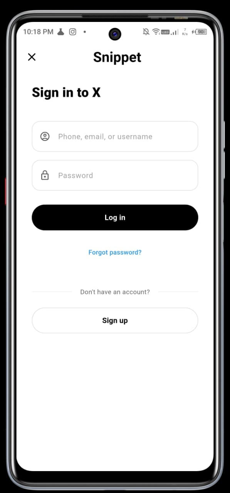

# Sippet - A Twitter Clone

Sippet is a feature-rich Twitter clone built with Flutter and Appwrite, offering a seamless social media experience with modern features and real-time interaction capabilities.

## Features Overview

- **Tweet Functionality**: Post, retweet, quote tweet, and reply to tweets
- **Rich Media Support**: Share images, GIFs, and videos in tweets
- **Audio Rooms**: Host and join live audio conversations
- **Real-time Notifications**: Stay updated with push notifications implemented using Signal
- **User Management**: Comprehensive profile management and verification
- **Search Capabilities**: Find users and tweets with advanced search
- **Local Algorithm**: Personalized content recommendations
- **Verification System**: Blue tick verification for notable accounts
- **Affiliated Profiles**: Professional badge for business accounts

## Screenshots

Here's a glimpse of Sippet in action:

| | | |
|---|---|---|
|  |  |  |
|  |  |  |

## Detailed Features

### Tweet Ecosystem
- **Create Tweets**: Share your thoughts with text up to 280 characters
- **Media Attachments**: Add images, GIFs, and videos to your tweets
- **Retweet**: Amplify tweets you appreciate with a single tap
- **Quote Tweet**: Add your perspective when sharing others' content
- **Replies**: Engage in threaded conversations with reply functionality
- **Hashtags and Mentions**: Organize content and connect with users

### Audio Rooms
- **Live Audio Conversations**: Host or join audio-only spaces
- **Speaker Management**: Hosts can manage who speaks in their rooms
- **Raise Hand Feature**: Request to speak in ongoing conversations
- **Room Discovery**: Find interesting audio discussions in real-time

### Notification System
- **Push Notifications**: Receive alerts for likes, retweets, mentions, and follows
- **In-app Notifications**: Access your notification history in the app
- **Customizable Alerts**: Control which notifications you receive

### User Management
- **Profile Customization**: Edit your bio, profile picture, and header image
- **Blue Tick Verification**: Verification system for notable accounts
- **Affiliated Profiles Badge**: Special badges for business/professional accounts
- **Privacy Controls**: Manage who can see your content and interact with you

### Discovery Features
- **Search**: Find users and tweets with advanced search capabilities
- **Local Recommendations**: Algorithm-based content suggestions
- **Trending Topics**: Discover what's popular in your region or globally

## Technology Stack

- **Frontend**: Flutter for cross-platform mobile application
- **Backend**: Appwrite for authentication, database, and storage
- **Real-time Communication**: Stream API for audio rooms and real-time features
- **Push Notifications**: Signal
- **Analytics**: Appwrite Analytics for usage statistics

## Getting Started

### Prerequisites
- Flutter SDK (2.10.0 or higher)
- Dart SDK (2.16.0 or higher)
- Android Studio or Visual Studio Code
- Appwrite server setup

### Installation

1. Clone the repository:
```bash
git clone https://github.com/yourusername/Sippet.git
cd Sippet
```

2. Install dependencies:
```bash
flutter pub get
```

3. Configure Appwrite:
   - Set up an Appwrite server or create an account on Appwrite Cloud
   - Create a new project in the Appwrite console
   - Set up database collections and storage buckets for the app
   - Configure authentication providers as needed
   - Add your Appwrite endpoint and project ID to the app configuration

4. Run the app:
```bash
flutter run
```

## Usage

1. **Sign Up/Login**: Create an account or sign in with existing credentials
2. **Create Profile**: Set up your profile with picture and bio
3. **Tweet**: Start sharing your thoughts with the world
4. **Discover**: Follow users and explore content through search and recommendations
5. **Engage**: Like, retweet, and reply to tweets that interest you
6. **Audio Rooms**: Join or create audio conversations on topics that matter to you

## Contributing

We welcome contributions to improve Sippet! Please follow these steps:

1. Fork the repository
2. Create your feature branch: `git checkout -b feature/amazing-feature`
3. Commit your changes: `git commit -m 'Add some amazing feature'`
4. Push to the branch: `git push origin feature/amazing-feature`
5. Open a Pull Request

## License

This project is licensed under the MIT License - see the LICENSE file for details.

## Acknowledgements

- [Flutter](https://flutter.dev/)
- [Appwrite](https://appwrite.io/)
- [Stream](https://getstream.io/)
- All contributors who have helped shape this project
